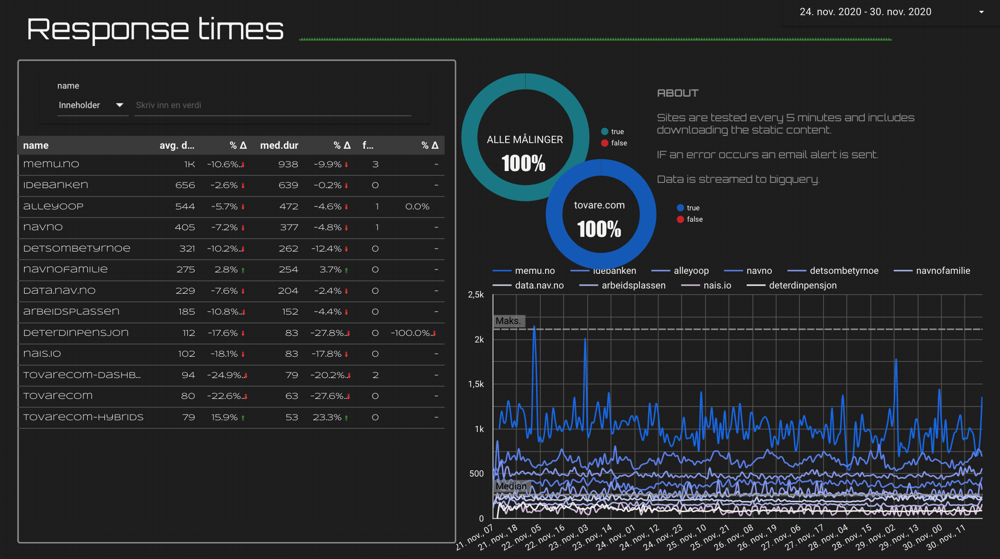

# A simple monitor

The Monitor a simple tool to check if services or sites are up or down.

Each test is defined by a simple URL and if there is an expected string
on the page to assess if the site is up or not.

The monitor is triggered every 5 minutes using a Cloud Trigger.
The tests are executed and compared against the prior results stored in
a Firestore database. If the status  has  changed an email is sent.

Each time all tests are executed the results are stored in Firestore.

# Streaming into BigQuery

* [Streaming](https://cloud.google.com/bigquery/streaming-data-into-bigquery)
* [DOC](https://godoc.org/cloud.google.com/go/bigquery)

# Future improvements

- [  ]  Improve email alerts with a list of services and their status.

